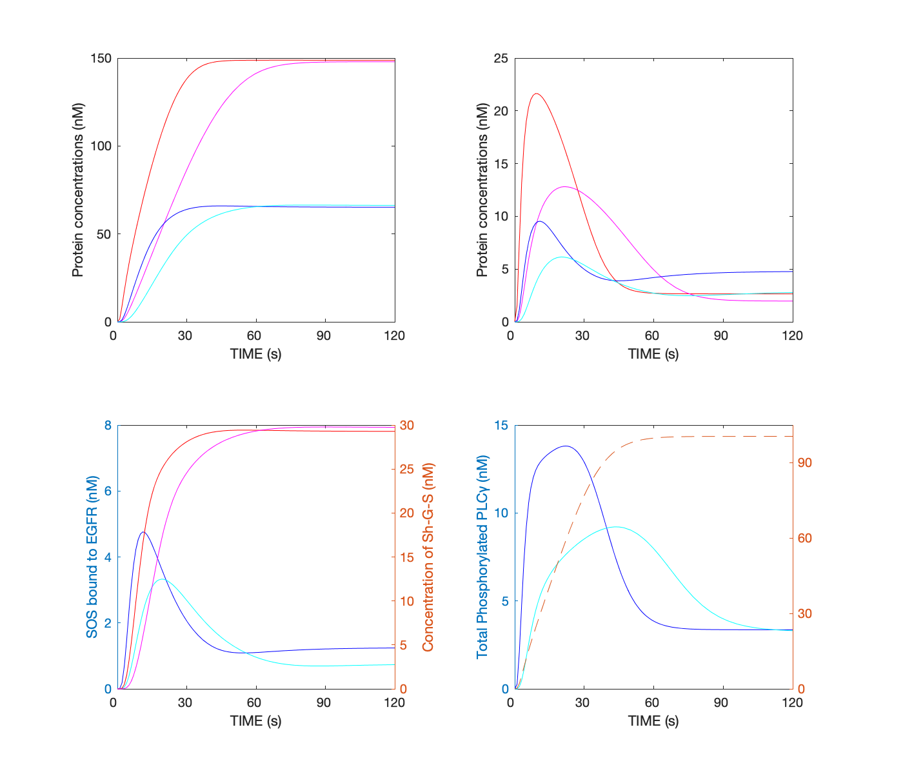

# egfr_model
Computation of the time course of downstream EGF signaling in hepatocytes.
- Kholodenko, B. N., Demin, O. V, Moehren, G. & Hoek, J. B. Quantification of short term signaling by the epidermal growth factor receptor. *J. Biol. Chem.* **274**, 30169–30181 (1999). https://doi.org/10.1074/jbc.274.42.30169
## Run Simulation and View Results
```matlab
runSim

```


- upper left
    - Total phosphorylated Shc (simulation <font color="Red">with 20 nM</font> and <font color="Magenta">with 2 nM</font> of EGF)
    - Total Grb2 coprecipitated with Shc (simulation <font color="Blue">with 20 nM</font> and <font color="Cyan">with 2 nM</font> of EGF)

- upper right
    - Total phosphorylated Shc bound to EGFR (simulation <font color="Red">with 20 nM</font> and <font color="Magenta">with 2 nM</font> of EGF)
    - Total Grb2 bound to EGFR (simulation <font color="Blue">with 20 nM</font> and <font color="Cyan">with 2 nM</font> of EGF)

- lower left
    - Total (activated) SOS bound to EGFR (simulation <font color="Blue">with 20 nM</font> and <font color="Cyan">with 2 nM</font> of EGF)
    - The concentration of Sh-G-S complex (simulation <font color="Red">with 20 nM</font> and <font color="Magenta">with 2 nM</font> of EGF)

- lower right
    - Total phosphorylated PLCγ (simulation <font color="Blue">with 20 nM</font> and <font color="Cyan">with 2 nM</font> of EGF, The *dashed line* shows the time course in the absence of the PLCγP translocation step)

## License
[MIT](LICENSE)